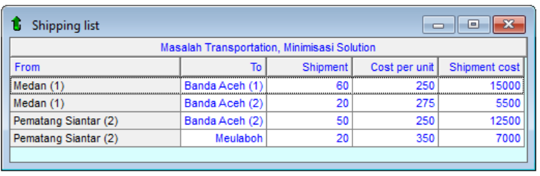
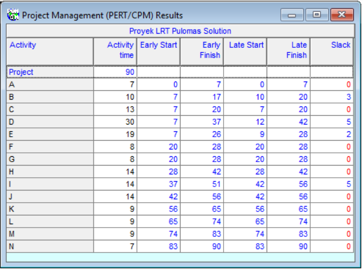
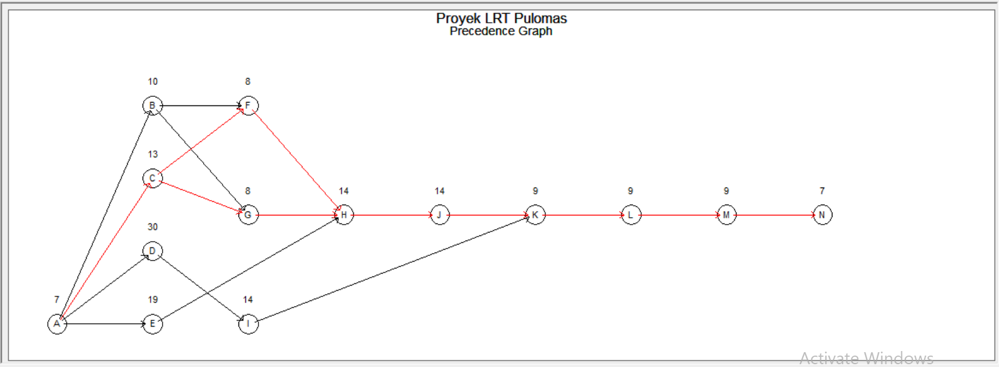

# Operations Research and Strategic Optimization Portfolio

## Project Overview
This repository contains operational analysis projects focusing on supply chain efficiency and project management. I used the POM-QM analytical framework to transform complex operational data into actionable business strategies that minimize costs and maximize resource utilization.

## 1. Fuel Distribution Cost Minimization in Supply Chain
This analysis solves a regional fuel distribution challenge for a state-owned energy company. The main objective was to determine the most cost-effective shipping routes from multiple supply points to various distribution centers.

### Optimization Results
By implementing the Transportation Model, I designed an optimized distribution network that successfully achieved a minimum total shipping cost of Rp 40,000,000. This route optimization guarantees that demand is met across all regions while maintaining the lowest possible operational expenditure.

---

## 2. Infrastructure Development Scheduling for LRT Pulomas
Managing large-scale infrastructure projects requires precise timing and resource allocation. For this project, I utilized Network Analysis to manage the construction timeline and identify potential bottlenecks before they happen.

### Scheduling Results
Through the Activity-on-Node method and Critical Path Method, I mapped the entire project progression. The analysis finalized a total project duration of 14 weeks and successfully pinpointed the critical activities that must be completed on strict deadlines to prevent overall project delays.

---

## Tools and Applied Methodologies
* All quantitative analyses were executed using POM-QM for Windows.
* The core analytical competencies demonstrated in these cases include Transportation Modeling, Network Analysis using PERT and CPM, and general Operations Management.
* I developed and taught these projects as part of my responsibilities during my tenure as an Operations Research Laboratory Assistant.

---
*Created as part of an ongoing Business Analytics Portfolio.*
